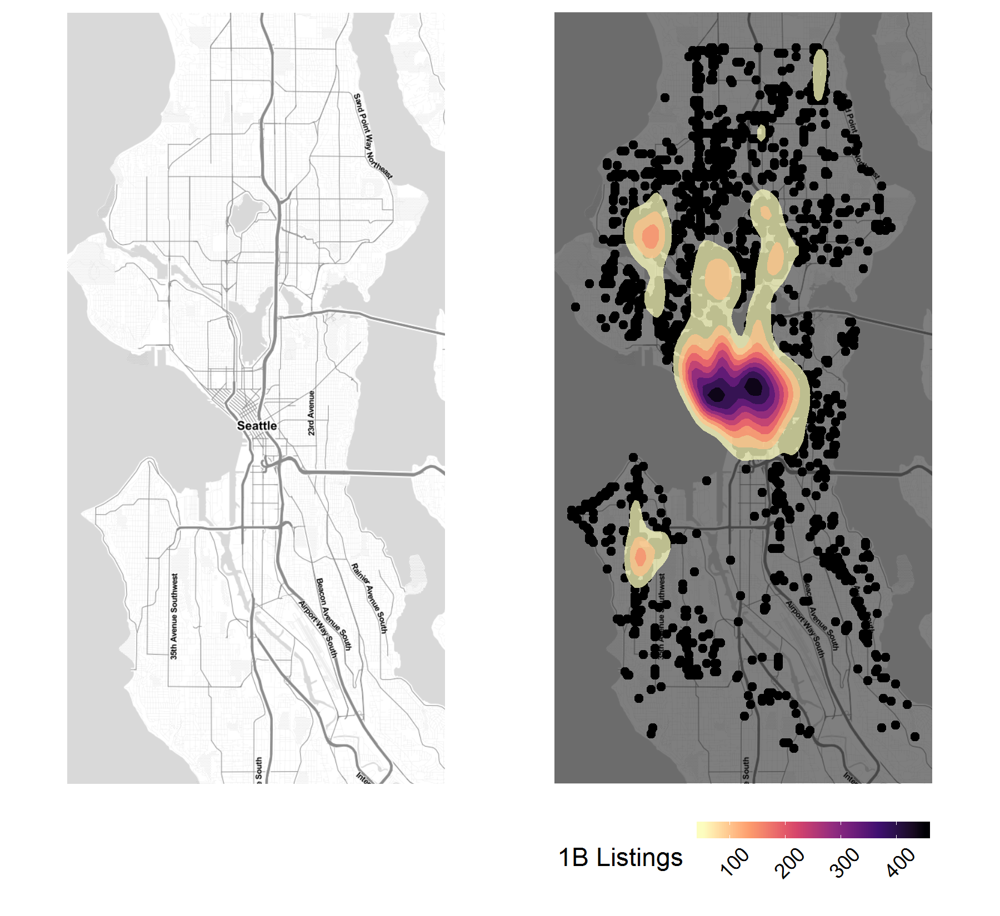
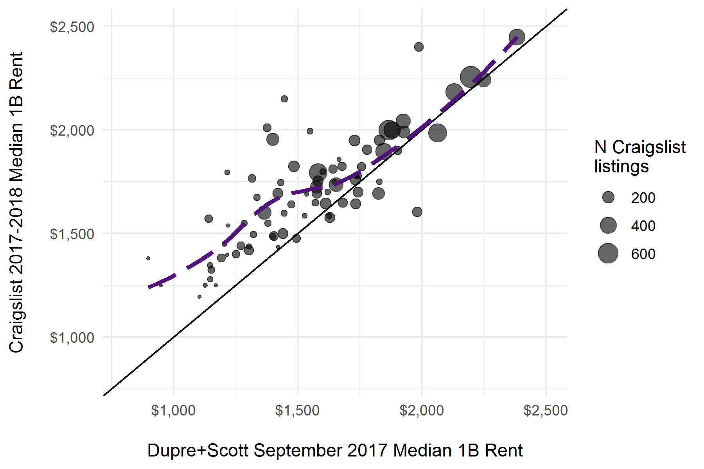

<style>
.list-group-item.active, .list-group-item.active:focus, .list-group-item.active:hover {
    background-color: #4b2e83;
}
</style>

```{r setup, include=FALSE}
#packages
library(tidyverse) #need dev version of ggplot
library(forcats)
library(haven)
library(lubridate)
library(haven)
library(zoo)
library(ggthemes)
library(RColorBrewer)
library(sp)
library(spdplyr)
library(geosphere)
library(rgdal)
library(rgeos)
library(sqldf)
library(spdep)
library(viridis)
library(latex2exp)

#load ACS data extract (codebook in folder)
census <- read_csv(file = "../input/acsExtract.csv")
censusRent <- read_csv(file = "../input/acsRent.csv")
census <- inner_join(census, censusRent) #1:1

#read in tract shapefiles for seattle
sea_shp <- readOGR(dsn = "../input/sea_tract_2010/sea_tract_2010.shp",
                  layer = "sea_tract_2010",
                  GDAL1_integer64_policy = TRUE,
                  stringsAsFactors = F)

#go ahead and save separate versions for graphics later
tract2000 <- readOGR(dsn = "../input/sea_tract_2000/sea_tract_2000.shp",
                  layer = "sea_tract_2000",
                  GDAL1_integer64_policy = TRUE,
                  stringsAsFactors = F) 
tract2010 <- sea_shp

#source data_load()
source("../helpers/load_data.R")

#use sourced function to load listing summaries
tract <- load_data()
```

<br>
<br>

## Introduction

Demand for rental housing units in Seattle, WA surged in the past decade, due to relative scarcity in available housing amidst a period of historic population growth. Substantial appreciation for almost 2 years straight raised Seattle home prices to levels where [most households are no longer able to buy a home](https://www.seattletimes.com/business/real-estate/seattle-area-homebuyers-needed-11000-pay-raise-in-past-year-to-keep-up-with-rising-prices/?utm_source=The+Seattle+Times&utm_campaign=de86e2d581-Morning_Brief_11_28_2017&utm_medium=email&utm_term=0_5beb38b61e-de86e2d581-122931741) short of "driving till they qualify". More and more households must rent to live in Seattle, and a [almost half](http://www.jchs.harvard.edu/ARH_2017_cost_burdens_by_metro) of these renter households pay 30% of their incomes on housing costs, if not more. Beyond individual households, the rising cost of housing in Seattle and in other cities has a role in neighborhood processes of "demographic inversion" like urban gentrification and [suburbanizing poverty](https://www.brookings.edu/testimonies/the-changing-geography-of-us-poverty/) too. 

[American Community Survey (ACS)](https://www.census.gov/programs-surveys/acs/) data have common currency among scholars and practitioners interested in metropolitan housing markets, but neverthless possess a substantial limitation for research in tight housing markets like Seattle---that is, at least two years elapse between data collection and publication, if not more. This publication lag for ACS data prohibits analyzing any market dynamics beyond long-term trends, particularly for estimates of smaller areas of aggregation like neighborhoods where ACS uses 5-year rolling-average methods as well. While more up-to-date options for neighborhood rent data exist through privately-held companies, such data can be somewhat of a black box in their creation and may be biased towards the costs of corporate-held properties. This would-be problem for academic researchers creates an opportunity for applying web scraping methods to generate a novel data on housing availability and costs.

This study demonstrates why scraped rental housing listings are a valuable source of data in subject areas such as housing studies and neighborhood demography. I draw on a set of descriptive analyses and models of quarterly rent levels among census tracts in Seattle, WA for this research objective. Summaries of the Craigslist data show agreement with existing sources in their distribution but do suggest higher median levels for most neighborhoods, likely given the listings' recent collection relative to other data. The smoothing models use the panel of quarterly neighborhood estimates' spatial and temporal structure to understand the underlying generative process, finding that a combination of local smoothing and autoregression (order 1) predict future levels with an average error of about $140 or 8%.

In a more general sense, the methods and frameworks used in this study also offer a template for efficiently collecting web data, conducting reproducible research, and publishing interactive results to GitHub. I start by briefly reviewing some background relevant to studying neighborhood rental housing. I then outline a process for automated web scraping of a rental listing source like Craigslist using a program called Helena, and compare aggregates from the collected rental listings with other data to assess rent agreement in measures. After describing the data and process, I present a set of models predicting neighborhood rent levels to understand different how different temporal and spatial structures fit the data. I conclude by discussing the promise of web data for subfields like housing studies and the value of R Markdown and GitHub for social science research. 

<br>

## Background

Existing public data are essentially limited to the American Community Survey (ACS) following the cessation of long-form decennial censuses in 2000. ACS data theoretically have two sources of error relative to the ``true'' median rent in a given overall market and to an even greater degree among neighborhood approximations like census tracts. Census sources of rental information cannot provide insight into any change in rental cost associated with newer developments becoming available (at least not until considerable time has already passed) given the temporal delay in data publication (i.e. ACS estimates are usually at least 2 years old, decennial many more). This feature of Census data is salient given newer housing units' generally higher rents and greater-than-average vacancy, both factors which lead to underestimating the present levels of rents for available housing units when either the ACS or decennial census are used as a current indicator. For already-leased rental housing units that are sampled, the temporal lag generates measurement error such that data on a given building's current asking rents may be underestimated relative to current tenants' payment levels.

For-profit data sources play a role in filling the information gap about rental housing costs, though they tend to possess their own unique shortcomings. These data sources tend to rely on survey methodologies for data collection, and ask landlords in a given market to outline the average cost for units of a given bedroom size or other specification. In exchange for providing detailed information for their database, the rental data provider may give participating landlords and property management companies access to a slice of information generated via accumulated data. These data tend to be rather opaque in their collection methodologies, with larger or corporate-owner properties most likely to appear in these data relative to independently-owned (i.e. mom and pop) rental units. 

<br>

## Data

### Web scraping using Helena

[Helena](http://helena-lang.org) is a high-level programming language for end users to automate web scraping as a method of data collection. Users write programs in an extension for Google Chrome by demonstrating the first row of data they want to collect using clicks, form interactions and highlighting values. The extension translates an initial demonstration into a starting script written in Helena, which a user can further modify or set to run on a regular schedule. Though Helena programs collect data roughly at the speed they are recorded at, users can run multiple programs in parallel to increase the volume of data collected. Data accumulate on a remote server (soon-to-be AWS) where users can later query either the full table of scraped data or a subset scraped within a specified number of hours. 

Helena learns where features of are through the user interface (UI) rather than the underlying document object model (DOM). Though the HTML code of a site may regularly change over the course of regular data scraping, websites less frequently undergo drastic overhauls to what their users interact with. Helena also uses skip blocks to avoid re-scraping the an already-collected item. These two aspects of Helena provide its programs robustness to common headaches encountered with web scraping by default. Overall, Helena's programming-by-demonstration method reduces time needed building a scraper from scratch, giving social scientists the capacity to quickly scrape a single table of data or build ongoing data processes.

For the UW team's data collection, a Helena program runs 24-hours a day and scrapes listings from the Seattle Craigslist. It is important to note that web scraping does violate Craigslist's Terms of Service, and that we are using all scraped data exclusively for academic research. For a more thorough discussion of this issue, consult page 3 of [Boeing and Waddell (2016)](https://arxiv.org/ftp/arxiv/papers/1605/1605.05397.pdf).

<br>

### Data Processing

The key steps of any data process can be distilled into three tasks: a.) _extract_ a table of interest from a specified origin source, b.) _transform_ it to support the desire analyses and c.) _load_ the transformed data to a storage destination for future use. 

In the present case, a program extracts scraped listings observed since the data updated by sending a download request to the scraper's accumulated data in the form of a URL with a suffix indicating the number of hours that passed since the last processing. The processing routine then transforms the data by cleaning up some of the scraped fields and appending spatial information through a multi-step geocoding proces. If address information was successfully scraped from the listing metadata, the script makes a call to Google Maps Geocoding API using this listing feature and a constraint to search within Washington state. When this first step is not successful at geocoding to a specific address or cross-streets, or where there is no address in the listing metadata, we use SmartyStreet's Address Extraction API on the listing's full scraped text to see if an address was mentioned there. We are able to geocode 95\% of listings to some degree of precision, with the vast majority precise at least to Zip9 geography. All listings used in the following analyses are geocoded with precision at least to Zip9 geography. After geocoding the data and ensuring there are no duplicates among the table of new listings, the script loads the processed listings into the existing database.

<br>

### Data Description

```{r map_point_density, echo=FALSE, message=FALSE, warning=FALSE}
#determine config (dev or github)
if(file.exists("../../data/cl/craigslistDB.sqlite")){
  source("../helpers/map_point_density.R") #if config, refresh plot pdf
}
```



```{r n_heatmap, echo=FALSE, message=FALSE, warning=FALSE}
#determine config (dev or github)
if(file.exists("../../data/cl/craigslistDB.sqlite")){
  source("../helpers/n_heatmap.R") #if config, refresh plot pdf
}
```


```{r rent_lineplot, echo=FALSE, message=FALSE, warning=FALSE}
#determine config (dev or github)
if(file.exists("../../data/cl/craigslistDB.sqlite")){
  source("../helpers/rent_lineplot.R") #if config, refresh plot pdf
}
```


```{r rent_map_across, echo=FALSE, message=FALSE, warning=FALSE}
#determine config (dev or github)
if(file.exists("../../data/cl/craigslistDB.sqlite")){
  source("../helpers/rent_map_across.R") #if config, refresh plot pdf
}
```


```{r rent_scatter_across, echo=FALSE, message=FALSE, warning=FALSE}
#determine config (dev or github)
if(file.exists("../../data/cl/craigslistDB.sqlite")){
  source("../helpers/rent_scatter_across.R") #if config, refresh plot pdf
}
```




<br>

## Models

- Need to build tables from output
- Need to do write up for tables
- Need to add graphic for predicted values

```{r construct panel (some missingness), echo=FALSE, message=FALSE, warning=FALSE}
#ensure order of census df matches shapefile
census <- census[match(sea_shp@data$GISJOIN, census$GISJOIN),]

#clean a few fields we might use
census <- census %>%
  mutate(nHU = AF7PE001,
         idtract = row_number(),
         pOwnoccHU = AF7PE002/AF7PE001,
         medHUVal = AF9LE001)
           
#store NULL object to bind iterated dfs into
panel <- NULL

#for each unique quarter in the CL data
for(i in unique(as.character(tract$listingQtr))){
  period <- tract %>% #start pipe with tract, end with period
    mutate(listingQtr = factor(listingQtr, ordered = T)) %>% #make factor
    filter(listingQtr == i) %>% #filter to qtr i
    right_join(census) %>% #right join to census, allows missingness
    ungroup() %>% #remove grouping by tract
    mutate(listingQtr = i, #listingQtr == current iteration
           Qtr = gsub(pattern = "^\\d{4} ", replacement = "", x = listingQtr)) #subset str to Q1,2,3,4
  panel <- bind_rows(panel, period) #append to panel object
}

#establish object for modeling based off of adjusting `panel`
sea_df <- panel %>% 
  mutate(actualRent = med1B, #first preserve the observed / observed-to-date
         med1B = ifelse(listingQtr == as.yearqtr(Sys.Date()), NA, med1B)) %>% #set to NA for INLA to forecast current qtr
  mutate(p1B = n1B/nListings) %>% #compute share of 1B listings
  arrange(listingQtr, GISJOIN) #arange qtr, tract
```

```{r run models, echo=FALSE, message=FALSE, warning=FALSE}
library(INLA)

#create adjacency matrix from shapefile
sea_adj <- poly2nb(sea_shp)

#create neighbor file that INLA takes for hyperparameter args
nb2INLA("../output/seatract.graph", sea_adj)
sea_df$idqtr <- factor(sea_df$listingQtr, ordered = T)
sea_df$idqtr1 <- sea_df$idqtr
sea_df$idtractqtr <- paste(sea_df$idtract, sea_df$Qtr)
sea_df$idtract1 <- sea_df$idtract
sea_df$Qtr1 <- sea_df$Qtr

#fixed effect for qtr only
form.int <- log(med1B) ~ 1 + Qtr

m.int <- inla(form.int, 
             family = "normal", 
             data = sea_df,
             control.predictor = list(compute = TRUE),
             control.compute = list(dic = TRUE, waic = TRUE))

summary(m.int)
sea_df$int_Med <- m.int$summary.linear.predictor[, "0.5quant"]
sea_df$int_SD <- m.int$summary.linear.predictor[, "sd"]
sea_df$int_postWidth <- m.int$summary.linear.predictor[, "0.975quant"] - m.int$summary.linear.predictor[,"0.025quant"]

#fixed qtr + iid tract random effect
form.ns <- log(med1B) ~ 1 + Qtr +
   f(idtract, model = "iid")

m.ns <- inla(form.ns, 
              family = "normal", 
              data = sea_df,
              control.predictor = list(compute = TRUE),
              control.compute = list(dic = TRUE, waic = TRUE))

summary(m.ns)
sea_df$ns_Med <- m.ns$summary.linear.predictor[, "0.5quant"]
sea_df$ns_SD <- m.ns$summary.linear.predictor[, "sd"]
sea_df$ns_postWidth <- m.ns$summary.linear.predictor[, "0.975quant"] - m.ns$summary.linear.predictor[,"0.025quant"]
sea_df$ns_Eff <- m.ns$summary.random$idtract[sea_df$idtract, "0.5quant"] 

#IID tract random effect + AR(1) process
form.nsar1 <- log(med1B) ~ 1 +
  f(idtract, model = "iid") +
  f(idqtr, model = "ar1") +
  f(idqtr1, model = "iid")

m.nsar1 <- inla(form.nsar1, 
               family = "normal", 
               data = sea_df,
               control.predictor = list(compute = TRUE),
               control.compute = list(dic = TRUE, waic = TRUE))

summary(m.nsar1) #NB: does not improve fit to use random effect time specification, using fixed effects
sea_df$nsar1_Med <- m.nsar1$summary.linear.predictor[, "0.5quant"]
sea_df$nsar1_SD <- m.nsar1$summary.linear.predictor[, "sd"]
sea_df$nsar1_postWidth <- m.nsar1$summary.linear.predictor[, "0.975quant"] - m.nsar1$summary.linear.predictor[,"0.025quant"]
sea_df$nsar1_Eff <- m.nsar1$summary.random$idtract[sea_df$idtract, "0.5quant"] 

#spatial random effect model (BYM 1991) with AR(1)
form.bym <- log(med1B) ~ 1 +
  f(idtract, model = "bym", #ICAR spatial RE for tract neighbors + IID RE for tract
    scale.model = T,
    graph = "../output/seatract.graph") +
  f(idqtr, model = "ar1") +
  f(idqtr1, model = "iid")

m.bym <- inla(form.bym, 
             family = "normal", 
             data = sea_df,
             control.predictor = list(compute = TRUE),
             control.compute = list(dic = TRUE, waic = TRUE))

summary(m.bym)
sea_df$bym_Med <- m.bym$summary.linear.predictor[, "0.5quant"]
sea_df$bym_SD <- m.bym$summary.linear.predictor[, "sd"]
sea_df$bym_postWidth <- m.bym$summary.linear.predictor[, "0.975quant"] - m.bym$summary.linear.predictor[,"0.025quant"]
sea_df$bym_Eff <- m.bym$summary.random$idtract[sea_df$idtract, "0.5quant"] 

#spatio-temporal smoothing model, with AR(1) and linear space-time interaction (Bernadelli 1995)
form.spt <- log(med1B) ~ 1 + 
  f(idtract, model = "bym", #ICAR spatial RE for tract neighbors + IID RE for tract
    scale.model = T,
    graph = "../output/seatract.graph") +
  f(idqtr, model = "ar1") +
  f(idqtr1, model = "iid") +
  f(idtractqtr, model = "iid")

m.spt <- inla(form.spt, 
              family = "normal", 
              data = sea_df,
              control.predictor = list(compute = TRUE),
              control.compute = list(dic = TRUE, waic = TRUE),
              control.inla = list(correct = TRUE, correct.factor = 10))

summary(m.spt)
sea_df$spt_Med <- m.spt$summary.linear.predictor[, "0.5quant"]
sea_df$spt_SD <- m.spt$summary.linear.predictor[, "sd"]
sea_df$spt_postWidth <- m.spt$summary.linear.predictor[, "0.975quant"] - m.spt$summary.linear.predictor[,"0.025quant"]
sea_df$spt_Eff <- m.spt$summary.random$idtract[sea_df$idtract, "0.5quant"] 

#overfitting? too much bumpiness qtr-to-qtr

#### Maps of Model Output ------------------------------------------------------------------

sea_df <- sea_df %>%
  mutate_at(.vars = vars(matches("_Med")),
            .funs = exp) %>%
  mutate_at(.vars = vars(matches("_SD")),
            .funs = exp) %>%
  group_by(GISJOIN) %>% 
  arrange(GISJOIN, listingQtr) %>%
  mutate(spt_traj = spt_Med - lag(spt_Med, 4)) %>%
  ungroup %>%
  group_by(GISJOIN) %>%
  mutate(spt_traj = sum(spt_traj, na.rm=T)) %>%
  ungroup() %>%
  mutate(bym_cuts = cut(bym_Med, 6),
         spt_cuts = cut(spt_Med, 6))

sea_shp@data$id <- rownames(sea_shp@data)
sea_shp@data <- left_join(sea_shp@data, sea_df)
sea_f <- fortify(sea_shp)
sea_f <- inner_join(sea_f, sea_shp@data,"id")

rmse <- function(error){sqrt(mean(error^2))}
mae <- function(error){mean(abs(error))}

#table of fit statistics
fit_stats <- sea_df %>%
  mutate(train_test = ifelse(listingQtr == as.yearqtr(Sys.Date()), "Test", "Training")) %>%
  mutate(int_err = actualRent - int_Med,
         ns_err = actualRent - ns_Med,
         nsar1_err = actualRent - nsar1_Med,
         bym_err = actualRent - bym_Med,
         spt_err = actualRent - spt_Med) %>% 
  group_by(train_test) %>%
  summarize(int_rmse = rmse(int_err[!is.na(int_err)]),
            int_mae = mae(int_err[!is.na(int_err)]),
            ns_rmse = rmse(ns_err[!is.na(ns_err)]),
            ns_mae = mae(ns_err[!is.na(ns_err)]),
            nsar1_rmse = rmse(nsar1_err[!is.na(nsar1_err)]),
            nsar1_mae = mae(nsar1_err[!is.na(nsar1_err)]),
            bym_rmse = rmse(bym_err[!is.na(bym_err)]),
            bym_mae = mae(bym_err[!is.na(bym_err)]),
            spt_rmse = rmse(spt_err[!is.na(spt_err)]),
            spt_mae = mae(spt_err[!is.na(spt_err)])) %>%
  dplyr::select(train_test, ends_with("_rmse"), ends_with("_mae"))
```

`r knitr::kable(fit_stats %>% select(ends_with("rmse")))`

`r knitr::kable(fit_stats %>% select(ends_with("mae")))`

<br>

## Results

<br>

## Discussion

<br>

## References