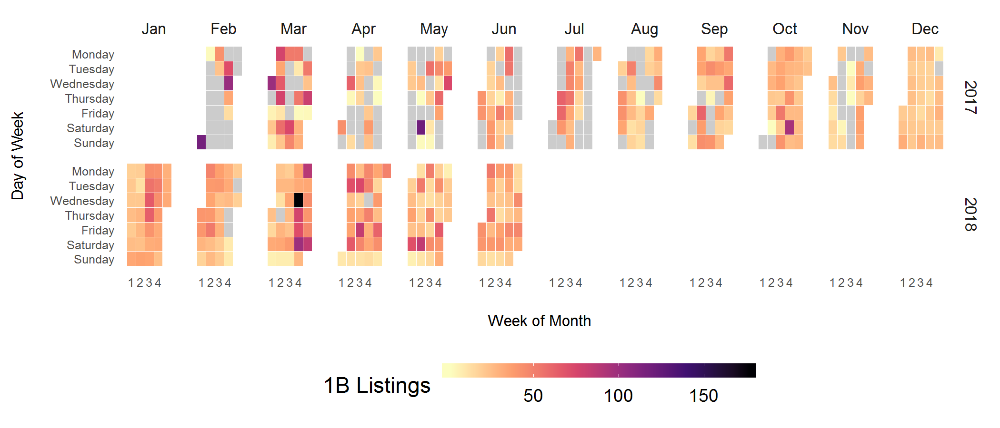
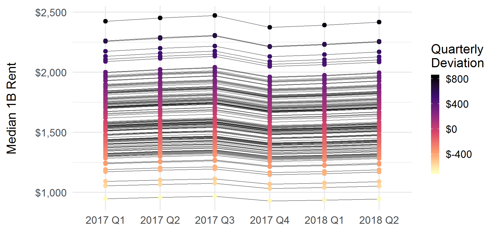
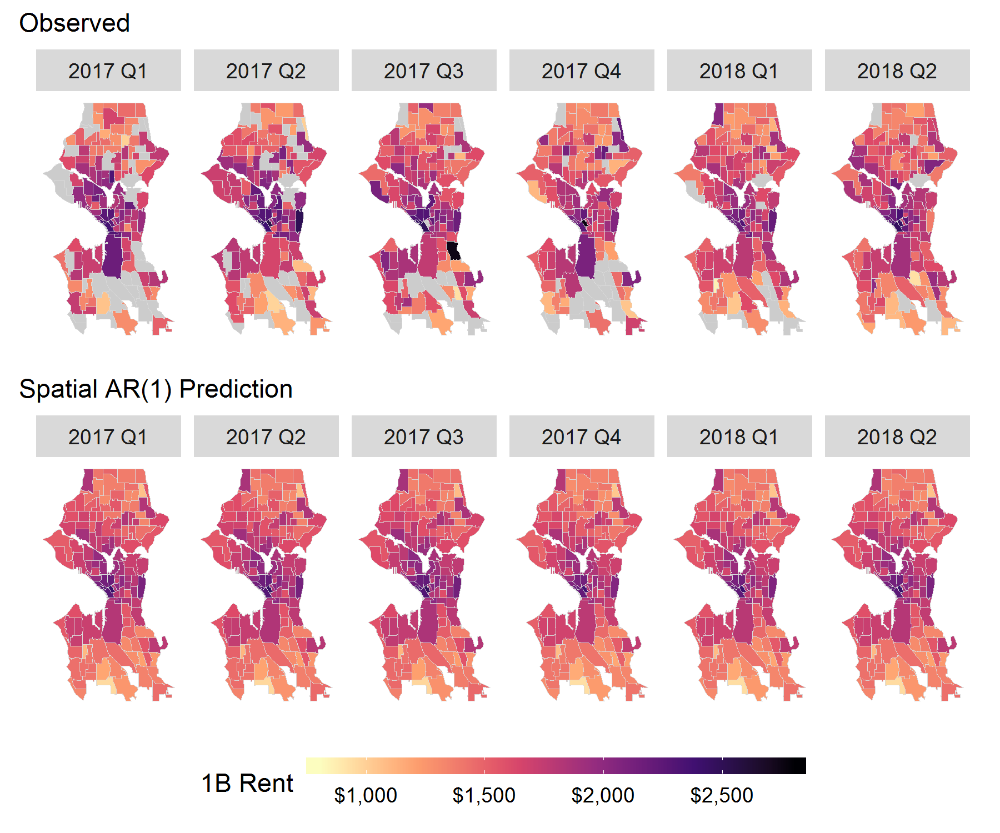

```{r setup, include=FALSE}
#packages
library(tidyverse) #need dev version of ggplot
library(forcats)
library(haven)
library(lubridate)
library(haven)
library(zoo)
library(ggthemes)
library(RColorBrewer)
library(sp)
library(spdplyr)
library(geosphere)
library(rgdal)
library(rgeos)
library(sqldf)
library(spdep)
library(viridis)
library(latex2exp)
library(plotly)

#load ACS data extract (codebook in folder)
census <- read_csv(file = "../input/acsExtract.csv")
censusRent <- read_csv(file = "../input/acsRent.csv")
census <- inner_join(census, censusRent) #1:1

#read in tract shapefiles for seattle
sea_shp <- readOGR(dsn = "../input/sea_tract_2010/sea_tract_2010.shp",
                  layer = "sea_tract_2010",
                  GDAL1_integer64_policy = TRUE,
                  stringsAsFactors = F)

#go ahead and save separate versions for graphics later
tract2000 <- readOGR(dsn = "../input/sea_tract_2000/sea_tract_2000.shp",
                  layer = "sea_tract_2000",
                  GDAL1_integer64_policy = TRUE,
                  stringsAsFactors = F) 
tract2010 <- sea_shp

#source data_load()
source("../helpers/load_data.R")

#use sourced function to load listing summaries
tract <- load_data()
```

<br>
<br>

## Introduction

Demand for rental housing units in Seattle, WA surged in the past decade, due to relative scarcity in available housing amidst a period of [historic population growth](https://www.seattletimes.com/seattle-news/data/114000-more-people-seattle-now-this-decades-fastest-growing-big-city-in-all-of-united-states/). Substantial appreciation for almost 2 years straight raised Seattle home prices to levels where [most households are no longer able to buy a home](https://www.seattletimes.com/business/real-estate/seattle-area-homebuyers-needed-11000-pay-raise-in-past-year-to-keep-up-with-rising-prices/?utm_source=The+Seattle+Times&utm_campaign=de86e2d581-Morning_Brief_11_28_2017&utm_medium=email&utm_term=0_5beb38b61e-de86e2d581-122931741) short of "driving till they qualify". More and more households must therefore rent to live in Seattle, and [almost half](http://www.jchs.harvard.edu/ARH_2017_cost_burdens_by_metro) of these renter households pay 30% of their incomes on housing costs, if not more. Given the universal need for housing, the individual dynamics related to rising housing costs have a role in shaping neighborhood processes of "demographic inversion" like urban gentrification and [suburbanizing poverty](https://www.brookings.edu/testimonies/the-changing-geography-of-us-poverty/) too. 

Census data have common currency among scholars and practitioners interested in metropolitan housing markets, but nevertheless possess a substantial limitation for research in tight housing markets like Seattle---that is, at least two years elapse between data collection and publication, if not more. This publication lag prohibits analyzing market dynamics beyond long-term trends, particularly for smaller areas of aggregation like neighborhoods where the estimate may be an average of survey responses from a 5 year period. While more up-to-date options for neighborhood rent data exist through privately-held companies, such data can be somewhat of a black box in their creation and may be biased towards the costs of corporate-held properties. This would-be problem for academic researchers creates an opportunity for applying web scraping methods to generate a novel data on housing availability and costs.

This study demonstrates why scraped rental housing listings are a valuable source of data in subject areas such as housing studies and neighborhood demography. We draw on a set of descriptive analyses and models of quarterly rent levels among census tracts in Seattle, WA for this research objective. Summaries of the Craigslist data show agreement with existing sources in their distribution but do suggest higher median levels for most neighborhoods, likely given the listings' recent collection relative to other data. The models use a quarterly panel of observed neighborhood median one-bedroom rents and produce temporally- and spatially-smoothed predictions about neighborhood rent levels. The best model specification in terms of forecasting Q2 2018 based on Q1 2017 through Q1 2018 has a combination of local spatial smoothing and autoregression (order 1), with an average forecast error of about $140 or 8% relative to the median neighborhood. In a more general sense, the methods and frameworks used in this study also offer a template for efficiently collecting web data, conducting reproducible research, and publishing interactive results to GitHub. 

We start by briefly reviewing some background relevant to studying neighborhood rental housing. I then outline a process for automated web scraping of a rental listing source like Craigslist using a program called Helena, and compare aggregates from the collected rental listings with other data to assess rent agreement in measures. After describing the data and process, We present a set of models predicting neighborhood rent levels to understand different how different temporal and spatial structures fit the data. We conclude by discussing the promise of web data for subfields like housing studies and the value of R Markdown and GitHub for social science research. 

<br>
<hr>
<br>

## Background

Existing public data are essentially limited to the [American Community Survey (ACS)](https://www.census.gov/programs-surveys/acs/) and [American Housing Survey (AHS)](https://www.census.gov/programs-surveys/ahs.html) following the cessation of long-form decennial censuses in 2000. These data theoretically have two sources of error relative to the "true"" current median rent for a market and neighborhood approximations like census tracts. Census sources of rental information cannot provide insight into any change in rental cost associated with newer developments becoming available (at least not until considerable time has already passed) given the temporal delay in data publication. This feature of Census data is salient given newer housing units' generally higher rents and greater-than-average vacancy, both factors which lead to underestimating the present levels of rents for available housing units when either the ACS or decennial census are used as a current indicator. For already-leased rental housing units that are sampled, the temporal lag generates measurement error such that data on a given building's current asking rents may be underestimated relative to current tenants' payment levels.

For-profit data sources play a role in filling the information gap about rental housing costs, but can still have their own limitations. These data sources tend to rely on survey methodologies for data collection, and ask landlords in a given market to outline the average cost for units of a given bedroom size or other specification. The quality of these data therefore depend on their capacity to adequately sample housing units across all property sizes, building qualities and locations, and the "mom and pop" end of the rental market spectrum is difficult to estimate in size, let alone survey sufficiently. In exchange for providing detailed information for their database, the rental data provider may give participating landlords and property management companies access to a slice of information generated via accumulated data. These data tend to be rather opaque in their collection methodologies, with larger or corporate-owner properties most likely to appear in these data relative to independently-owned (i.e. mom and pop) rental units. 

<br>
<hr>
<br>

## Data

### Web Scraping using Helena

[Helena](http://helena-lang.org) is a high-level programming language aimed at helping end users automate web scraping as a method of data collection. Users write programs in an extension for Google Chrome by demonstrating the first row of data they want to collect using clicks, form interactions and highlighting values. The extension translates an initial demonstration into a starting script written in Helena, which a user can further modify or set to run on a regular schedule. Though Helena programs collect data roughly at the speed they are recorded at, users can run multiple programs in parallel to increase the volume of data collected. Data accumulate on a remote server (soon-to-be AWS) where users can later query either the full table of scraped data or a subset scraped within a specified number of hours. 

Helena learns where features of are through the user interface (UI) rather than the underlying document object model (DOM). Though the HTML code of a site may regularly change over the course of regular data scraping, websites less frequently overhaul what their users actually interact with. Helena also uses skip blocks to avoid re-scraping the an already-collected item. These two aspects of Helena provide its programs robustness to common headaches encountered with web scraping by default. Overall, Helena's programming-by-demonstration method reduces time needed building a scraper from scratch, giving social scientists the capacity to quickly scrape a single table of data or build ongoing data processes.

For the UW team's data collection, a Helena program runs 24-hours a day and scrapes listings from the Seattle Craigslist. It is important to note that web scraping does violate Craigslist's Terms of Service, and that we are using all scraped data exclusively for academic research. For a more thorough discussion of this issue, consult page 3 of [Boeing and Waddell (2016)](https://arxiv.org/ftp/arxiv/papers/1605/1605.05397.pdf).

<br>
<hr>
<br>

### Data Processing

The key steps of any data process can be distilled into three tasks: a.) _extract_ a table of interest from a specified origin source, b.) _transform_ it to support the desired analyses and c.) _load_ the transformed data to a storage destination for future use. In the present case, a program extracts scraped listings observed since the data updated by sending a download request to the scraper's accumulated data in the form of a URL with a suffix indicating the number of hours that passed since the last processing. The processing routine then transforms the data by cleaning up some of the scraped fields and appending spatial information through a multi-step geocoding process. 

If address information was successfully scraped from the listing metadata, the script makes a call to Google Maps Geocoding API using this listing feature and a constraint to search within Washington state. When this first step is not successful at geocoding to a specific address or cross-streets, or where there is no address in the listing metadata, we use SmartyStreet's Address Extraction API on the listing's full scraped text to see if an address was mentioned there. We are able to geocode 95\% of listings to some degree of precision, with the vast majority precise at least to Zip9 geography. All listings used in the following analyses are geocoded with precision at least to Zip9 geography. After geocoding the data and ensuring there are no duplicates among the table of new listings, the script loads the processed listings into the existing database.

<br>
<hr>
<br>

### Data Description

We have collected `r sum(tract$nListings)` Seattle rental housing listings from Craigslist over the course of our data collection (`r min(tract$listingQtr)` to `r max(tract$listingQtr)`). Among the overall listings we've collected, `r sum(tract$n1B)` (about `r round(sum(tract$n1B)/sum(tract$nListings), 2)*100`%) were one-bedroom listings. 

The following series of graphics summarize the listing data collected to date and compare rent estimates from these data to ACS data and Dupre+Scott. In an attempt to compare summaries about like rental units as much as possible, visualizations focus on one-bedroom units in all but one instance. One-bedroom units are tied with the combined share of two and three bedroom units for the [most common unit bedroom size](https://factfinder.census.gov/bkmk/table/1.0/en/ACS/16_1YR/S2504/1600000US5363000) in Seattle according to 2016 ACS data. For Figure 2, data limitations require that the comparison is all housing units since ACS only recently (i.e. 2015-2016) started publishing bedroom-specific rent levels.

<br>
<hr>
<br>

Figure 1 shows a reference map of Seattle on the left. Opposite this is a visualization of the scraped Seattle rental listing data. Each point indicates a one-bedroom listing collected at some point over our study's span. The polygons overlaid on higher-density neighborhoods around Downtown, South Lake Union and Ballard correspond to particularly strong Craigslist listing activity.

<br>

```{r map_point_density, echo=FALSE, message=FALSE, warning=FALSE}
#determine config (dev or github)
if(file.exists("../../data/cl/craigslistDB.sqlite")){
  source("../helpers/map_point_density.R") #if config, refresh plot pdf
}
```


<br>
<hr>
<br>

Figure 2 is a heatmap for the time-series of one-bedroom listings per day. The grey cells indicate days where our scraper was offline. Outages were more common in the earliest phases of work, but now are relatively rare. 

At the end of February 2018 we implemented a procedure to have the Helena program immediately restart scraping (i.e. re-query the available listings as a new index to work through) in order to ensure any and all listings are scraped each day. The net impact of this change is fairly evident in the time-series heatmap. We now see more temporal structure to the listing count for each day---relatively fewer listings are posted on Sundays, though this could be related to greater listing on Saturdays (i.e. everything is posted at the beginning of the weekend in order to maximize weekend housing searchers' likelihoods of seeing it). Perhaps unsurprisingly, there were dips in listing activity on prominent holidays like Christmas, New Year's Day, and Memorial Day.

<br>

```{r n_heatmap, echo=FALSE, message=FALSE, warning=FALSE}
#determine config (dev or github)
if(file.exists("../../data/cl/craigslistDB.sqlite")){
  source("../helpers/n_heatmap.R") #if config, refresh plot pdf
}
```



<br>
<hr>
<br>

Figure 3 is a line graphic indicating agreement across data for Seattle-wide median rent (all sizes of rental units). The longest set of data (Dupre+Scott) cover 20 years and show long-term dynamics of Seattle rental housing costs in terms of contract rent. Dupre+Scott released semi-annual summaries for their 20+ unit data, so there are two data points for each year (Spring and Fall). ACS 1-Year Estimates show the median renter-occupied housing unit asking rent. Craigslist shows quarterly estimates for all listings in Seattle. 

The first takeaway from the graphic is the large spike in rent levels following 2010, with a similar trajectory followed in the estimates from Dupre+Scott and the ACS. Throughout the span of Dupre+Scott and ACS data, these two indicators differ by about $100-150 at any given point, though the disagreement is at its largest at the ACS data's current endpoint of 2016. Given that the Dupre+Scott data and ACS data both sample rents from already-leased-up units (exclusively in the case of ACS), a plausible explanation for this systematic difference is that Dupre+Scott rent estimates reflect only the population of rental units in larger structures (whereas ACS is theoretically sampling rental units of all property sizes and characteristics.

<br>

```{r rent_lineplot, echo=FALSE, message=FALSE, warning=FALSE}
#determine config (dev or github)
if(file.exists("../../data/cl/craigslistDB.sqlite")){
  source("../helpers/rent_lineplot.R") #if config, refresh plot pdf
}
```


<br>

Only the Craigslist and Dupre+Scott can offer insight into more recent median levels for the Seattle rental housing market. Both data suggest continued increases in the market-wide median rent for the first half of 2017, though the Craigslist slope is about twice in its size. Some of greater variation observed between the first and second data points of the Craigslist series may be related to missing listings (whether due to the early-stage process or outages), something which might bias the estimate for 2017 Q2 upward in favor of regularly posted commercial listings. Though the estimates here reflect deduplicated listings, regularly updating a listing raises its likelihood of being at the top of the index our scraper works off of, thereby increasing its selection probability. This volatility in Craigslist asking rents could also be brought on by recently-developed buildings in "lease-up" adding a glut of expensive listings to the quarters' samples.

However, by the final point of Dupre+Scott's series (Fall 2017, corresponding to September), the difference compared to the Craigslist median was about $75. Mirroring other accounts about a decline in rents during Winter 2018, the Craigslist data showed a fairly precipitous decline between 

<br>
<hr>
<br>

The focus of the data description now turns towards estimating median rents for specific neighborhoods. While zip codes, unofficial City neighborhoods and even arbitrary grid geographies can all be used to aggregate micro-data about rental housing, we compare census tract estimates because they roughly approximate neighborhood-size units and can be linked with a variety of other data in Seattle and more generally. The following links provide reference maps for Seattle Census tracts ([2000](https://www.seattle.gov/Documents/Departments/OPCD/Demographics/GeographicFilesandMaps/2000CensusSeattleTractMap.pdf) and [2010](https://www.seattle.gov/Documents/Departments/OPCD/Demographics/GeographicFilesandMaps/2010CensusTractsandZipCodeBoundaries.pdf))

In the following graphic, the left most pane shows median one-bedroom asking rent estimates using data collected from Craigslist in 2017-2018. The middle pane shows Dupre+Scott tract median 1B contract rent estimates for one-bedrooms in 20+ unit apartment structures according to their September 2017 (Fall) survey of local landlords and property managers. These data were only available in 2000 Census geography, so the neighborhood units differ slightly (124 tracts versus 134 tracts) in this map compared to the other two. Though less than ideal, this limitation does not drastically alter the comparison between data.  Finally, on the right are ACS 2012-2016 5-Year Estimates (the most recent ACS small-area data product available). In all map panes, grey cells denote missing values.

<br>

```{r rent_map_across, echo=FALSE, message=FALSE, warning=FALSE}
#determine config (dev or github)
if(file.exists("../../data/cl/craigslistDB.sqlite")){
  source("../helpers/rent_map_across.R") #if config, refresh plot pdf
}
```


<br>

Both the Craigslist and Dupre+Scott data largely agree on the spatial distribution of one-bedroom rents. The similarity is greatest in the downtown and higher-density neighborhoods where the stock of corporate-held rental housing units theoretically accounts for a most of a tract's rental housing units (i.e. Dupre+Scott closer to a census if they sample all 20+ unit properties). Nonetheless, the systematic difference is such that Craigslist levels are typically at least a little higher. A detailed comparison of the Craigslist and Dupre+Scott estimates follows in the next figure where we directly compare 2000-definition census tract estimates from Craigslist and Dupre+Scott.

Though the spatial distribution of the ACS estimates resembles that of the other two data sources, the values are nonetheless systematically lower (in most cases by hundreds of dollars). The ACS measures therefore give insight into the relative ranking of neighborhoods in terms of rental costs, but are limited for studying neighborhood dynamics outside of long-run trend. 

<br>
<hr>
<br>

Figure 5 shows a scatter plot/bubble plot of 2000-definition Census tract one-bedroom rent estimates between Craigslist and Dupre+Scott for the 75 tracts where comparable estimates exist. The purple dashed line indicates the loess smoother fit between the measures. Looking at the measure comparison, the first takeaway is that there is strong correlation ($r = .82$) and good agreement between the measures (mean absolute difference = $186). The Craigslist measure reflects asking rents and the Dupre+Scott measure reflects contract rents for a neighborhood (i.e. the asking rent less an incentives a landlord offers). Given the currently low vacancy rates in most properties, the only neighborhoods where there would theoretically be more salience to the asking vs contract rent distinction (i.e. a wider gap in these indicators) are at the high end of the distribution where demand for luxury apartments has slackened some. At the high-end of the neighborhood rent distribution, however, Craigslist and Dupre+Scott are in arguably the strongest agreement.

<br>

```{r rent_scatter_across, echo=FALSE, message=FALSE, warning=FALSE}
#determine config (dev or github)
if(file.exists("../../data/cl/craigslistDB.sqlite")){
  source("../helpers/rent_scatter_across.R") #if config, refresh plot pdf
}
```


<br>

An alternative explanation for the difference between measures comes in considering the units these properties are sampling from in a given neighborhood. The greater difference between the measures among lower-rent neighborhoods (with Craigslist estimating these as more expensive than Dupre+Scott) provides some evidence for this theory. These tracts are found towards the North and South edges of the city, and generally are more residential neighborhoods where 20+ unit apartment complexes are not the entire stock of rental unit properties. In these tracts, Craigslist has a non-zero probability of sampling from any larger building but also small houses, duplex/triplexes, mother-in-law suites and recently, [Accessory Dwelling Units (ADUs)](http://www.seattle.gov/DPD/Publications/CAM/cam116a.pdf). 

To the extent that these smaller property units may tend to be newer, larger in housing unit square footage or offer added amenities, the true value of rent for the neighborhood will be higher than what it is estimated at using 20+ unit properties alone. Similarly, the more that smaller properties account for the overall population of rental housing units, the more likely that higher values indicated in Craigslist are not erroneous but instead reflective of a broader set of residential units.

<br>

## Models

The following models learn from Craigslist data accumulated up till the prior quarter (i.e. `r as.yearqtr(Sys.Date())-1`) to accomplish a few different goals. The most prominent goal is to use the panel data's temporal and spatial structure to understand variation in rent levels over time and across space. A secondary goal is to forecast the Seattle neighborhood rent surface for the current quarter. Finally, the following models allow for relatively straightforward imputation of missing values based on time period and the rent values of proximate tracts. 

We assume that the log of the median one-bedroom rent for Seattle neighborhoods is normally distributed and compute the posterior distributions of each model's hyperparameters and parameters $\theta_{it}$ using [integrated nested Laplace approximations (INLA)](https://folk.ntnu.no/hrue/r-inla.org/papers/inla-rss.pdf) with the default, weakly-informative priors for all random-effects. We choose to log the dependent variable because all values are positive and this transformation improves model fit.

Formally, models assume:

$log(Y_{it})|\theta_{it} \sim \mbox{Normal}(\theta_{it})$ with:

Model                    | Abbr.   | Formula
------------------------ | ------- | ----------------------------------------------
Fixed Intercept          | `int`   | $\theta_{it} = \beta_0 + \gamma_t$
Non-Spatial              | `ns`    | $\theta_{it} = \beta_0 + \nu_i + \gamma_t$
Non-Spatial AR(1)        | `nsar1` | $\theta_{it} = \beta_0 + x_t + \phi_t + \nu_i$
BYM Spatial AR(1)        | `bym `  | $\theta_{it} = \beta_0 + x_t + \phi_t + v_i + \nu_i$
BYM Spatiotemporal AR(1) | `spt`   | $\theta_{it} = \beta_0 + x_t + \phi_t + v_i + \nu_i + \delta_{it}$

The Fixed Intercept model (`int`) has a global intercept ($\beta_0$) and fixed effects ($\gamma_t$) for each quarter of each year. The Non-Spatial (`ns`) model adds random noise (i.i.d.) tract random-effects ($\nu_i \sim Normal(0, \tau_\nu)$) to the Fixed Intercept specification. The Non-Spatial AR(1) model (`nsar1`) then incorporates term an AR(1) random-effect ($x_1 \sim \mbox{Normal}(0, (\tau(1-\rho^2))^{-1})$ where $x_t = \rho x_{t-1} + \epsilon_t$) to dynamically model the temporal variation. This model includes a random noise term ($\phi_t \sim Normal(0, \tau_\phi)$) for each quarter too.

The BYM Spatial with AR(1) includes a random-effect drawn from the [Besag-York-Mollie (1991)](https://link.springer.com/article/10.1007/BF00116466) intrinsic conditional autoregressive (ICAR) distribution, along with AR(1) and exchangeable hyperparameters for the panel's temporal structure (referred to as `bym` using shorthand). The random-effect $v_i$ is assumed to come from a normal distribution whose mean is the mean of the neighbors' random effects and variance proportional to the number of neighbors (formally, $v_i|v_j, j \in ne(i) ~ \mbox{Normal}(\bar{v_i}, \frac{\sigma^{2}_v}{m_j})$. Lastly, the BYM Spatiotemporal AR(1) (`spt`) adds an exchangeable random-effect ($\delta_i \sim Normal(0, \tau_\delta)$) for each period to allow for area-specific deviations in time trends.

The space and time smoothing models used in this section partially pool the data (e.g. the same observation at different points in time, a tract's neighboring units) to measure the degree of variation across different quarters and at different points in space. These models are common in epidemiology and disease-mapping applications where researchers need to estimate a quantity of interest like a relative risk but have sparse data for some areas (which may differ from truth due to sampling variability). Modelling a panel's error structure with random-effects for space and time penalizes bumpiness (local deviations) in predicted values and theoretically improves out-of-sample accuracy (because large local deviations can stem from low $n$ in a given area). The spatial models in particular allow for missing data to be imputed based off of a local average of neighbors rather than the global or period-specific average. 

## Results

Visit the interactive results dashboard [here](http://hesscl.com/smooth-sea/dashboard/index.html).

```{r construct panel (some missingness), echo=FALSE, message=FALSE, warning=FALSE}
#ensure order of census df matches shapefile
census <- census[match(sea_shp@data$GISJOIN, census$GISJOIN),]

#clean a few fields we might use
census <- census %>%
  mutate(nHU = AF7PE001,
         idtract = row_number(),
         pOwnoccHU = AF7PE002/AF7PE001,
         medHUVal = AF9LE001)
           
#store NULL object to bind iterated dfs into
panel <- NULL

#for each unique quarter in the CL data
for(i in unique(as.character(tract$listingQtr))){
  period <- tract %>% #start pipe with tract, end with period
    mutate(listingQtr = factor(listingQtr, ordered = T)) %>% #make factor
    filter(listingQtr == i) %>% #filter to qtr i
    right_join(census) %>% #right join to census, allows missingness
    ungroup() %>% #remove grouping by tract
    mutate(listingQtr = i, #listingQtr == current iteration
           Qtr = gsub(pattern = "^\\d{4} ", replacement = "", x = listingQtr)) #subset str to Q1,2,3,4
  panel <- bind_rows(panel, period) #append to panel object
}

#establish object for modeling based off of adjusting `panel`
sea_df <- panel %>% 
  mutate(actualRent = med1B, #first preserve the observed / observed-to-date
         med1B = ifelse(listingQtr == as.yearqtr(Sys.Date()), NA, med1B)) %>% #set to NA for INLA to forecast current qtr
  mutate(p1B = n1B/nListings) %>% #compute share of 1B listings
  arrange(listingQtr, GISJOIN) #arange qtr, tract
```

```{r run models, echo=FALSE, message=FALSE, warning=FALSE}
library(INLA)

#create adjacency matrix from shapefile
sea_adj <- poly2nb(sea_shp)

#create neighbor file that INLA takes for hyperparameter args
nb2INLA("../output/seatract.graph", sea_adj)
sea_df$idqtr <- factor(sea_df$listingQtr, ordered = T)
sea_df$idqtr1 <- sea_df$idqtr
sea_df$idtractqtr <- paste(sea_df$idtract, sea_df$Qtr)
sea_df$idtract1 <- sea_df$idtract
sea_df$Qtr1 <- sea_df$Qtr

#fixed effect for qtr only
form.int <- log(med1B) ~ 1 + Qtr

m.int <- inla(form.int, 
             family = "normal", 
             data = sea_df,
             control.predictor = list(compute = TRUE),
             control.compute = list(dic = TRUE, waic = TRUE))

#summary(m.int)
sea_df$int_Med <- m.int$summary.linear.predictor[, "0.5quant"]
sea_df$int_SD <- m.int$summary.linear.predictor[, "sd"]
sea_df$int_postWidth <- m.int$summary.linear.predictor[, "0.975quant"] - m.int$summary.linear.predictor[,"0.025quant"]

#fixed qtr + iid tract random effect
form.ns <- log(med1B) ~ 1 + Qtr +
   f(idtract, model = "iid")

m.ns <- inla(form.ns, 
              family = "normal", 
              data = sea_df,
              control.predictor = list(compute = TRUE),
              control.compute = list(dic = TRUE, waic = TRUE))

#summary(m.ns)
sea_df$ns_Med <- m.ns$summary.linear.predictor[, "0.5quant"]
sea_df$ns_SD <- m.ns$summary.linear.predictor[, "sd"]
sea_df$ns_postWidth <- m.ns$summary.linear.predictor[, "0.975quant"] - m.ns$summary.linear.predictor[,"0.025quant"]
sea_df$ns_Eff <- m.ns$summary.random$idtract[sea_df$idtract, "0.5quant"] 

#IID tract random effect + AR(1) process
form.nsar1 <- log(med1B) ~ 1 +
  f(idtract, model = "iid") +
  f(idqtr, model = "ar1") +
  f(idqtr1, model = "iid")

m.nsar1 <- inla(form.nsar1, 
               family = "normal", 
               data = sea_df,
               control.predictor = list(compute = TRUE),
               control.compute = list(dic = TRUE, waic = TRUE))

#summary(m.nsar1) #NB: does not improve fit to use random effect time specification, using fixed effects
sea_df$nsar1_Med <- m.nsar1$summary.linear.predictor[, "0.5quant"]
sea_df$nsar1_SD <- m.nsar1$summary.linear.predictor[, "sd"]
sea_df$nsar1_postWidth <- m.nsar1$summary.linear.predictor[, "0.975quant"] - m.nsar1$summary.linear.predictor[,"0.025quant"]
sea_df$nsar1_Eff <- m.nsar1$summary.random$idtract[sea_df$idtract, "0.5quant"] 

#spatial random effect model (BYM 1991) with AR(1)
form.bym <- log(med1B) ~ 1 +
  f(idtract, model = "bym", #ICAR spatial RE for tract neighbors + IID RE for tract
    scale.model = T,
    graph = "../output/seatract.graph") +
  f(idqtr, model = "ar1") +
  f(idqtr1, model = "iid")

m.bym <- inla(form.bym, 
             family = "normal", 
             data = sea_df,
             control.predictor = list(compute = TRUE),
             control.compute = list(dic = TRUE, waic = TRUE))

#summary(m.bym)
sea_df$bym_Med <- m.bym$summary.linear.predictor[, "0.5quant"]
sea_df$bym_SD <- m.bym$summary.linear.predictor[, "sd"]
sea_df$bym_postWidth <- m.bym$summary.linear.predictor[, "0.975quant"] - m.bym$summary.linear.predictor[,"0.025quant"]
sea_df$bym_Eff <- m.bym$summary.random$idtract[sea_df$idtract, "0.5quant"] 

#spatio-temporal smoothing model, with AR(1) and linear space-time interaction (Bernadelli 1995)
form.spt <- log(med1B) ~ 1 + 
  f(idtract, model = "bym", #ICAR spatial RE for tract neighbors + IID RE for tract
    scale.model = T,
    graph = "../output/seatract.graph") +
  f(idqtr, model = "ar1") +
  f(idqtr1, model = "iid") +
  f(idtractqtr, model = "iid")

m.spt <- inla(form.spt, 
              family = "normal", 
              data = sea_df,
              control.predictor = list(compute = TRUE),
              control.compute = list(dic = TRUE, waic = TRUE),
              control.inla = list(correct = TRUE, correct.factor = 10))

#summary(m.spt)
sea_df$spt_Med <- m.spt$summary.linear.predictor[, "0.5quant"]
sea_df$spt_SD <- m.spt$summary.linear.predictor[, "sd"]
sea_df$spt_postWidth <- m.spt$summary.linear.predictor[, "0.975quant"] - m.spt$summary.linear.predictor[,"0.025quant"]
sea_df$spt_Eff <- m.spt$summary.random$idtract[sea_df$idtract, "0.5quant"] 

#overfitting? too much bumpiness qtr-to-qtr

#### Maps of Model Output ------------------------------------------------------------------

sea_df <- sea_df %>%
  mutate_at(.vars = vars(matches("_Med")),
            .funs = exp) %>%
  mutate_at(.vars = vars(matches("_SD")),
            .funs = exp) %>%
  group_by(GISJOIN) %>% 
  arrange(GISJOIN, listingQtr) %>%
  mutate(spt_traj = spt_Med - lag(spt_Med, 4)) %>%
  ungroup %>%
  group_by(GISJOIN) %>%
  mutate(spt_traj = sum(spt_traj, na.rm=T)) %>%
  ungroup() %>%
  mutate(bym_cuts = cut(bym_Med, 6),
         spt_cuts = cut(spt_Med, 6))

sea_shp@data$id <- rownames(sea_shp@data)
sea_shp@data <- left_join(sea_shp@data, sea_df)
sea_f <- fortify(sea_shp)
sea_f <- inner_join(sea_f, sea_shp@data,"id")

rmse <- function(error){sqrt(mean(error^2))}
mae <- function(error){mean(abs(error))}

#table of fit statistics
fit_stats <- sea_df %>%
  mutate(train_test = ifelse(listingQtr == as.yearqtr(Sys.Date()), "Test", "Training")) %>%
  mutate(int_err = actualRent - int_Med,
         ns_err = actualRent - ns_Med,
         nsar1_err = actualRent - nsar1_Med,
         bym_err = actualRent - bym_Med,
         spt_err = actualRent - spt_Med) %>% 
  group_by(train_test) %>%
  summarize(int_rmse = rmse(int_err[!is.na(int_err)]),
            int_mae = mae(int_err[!is.na(int_err)]),
            ns_rmse = rmse(ns_err[!is.na(ns_err)]),
            ns_mae = mae(ns_err[!is.na(ns_err)]),
            nsar1_rmse = rmse(nsar1_err[!is.na(nsar1_err)]),
            nsar1_mae = mae(nsar1_err[!is.na(nsar1_err)]),
            bym_rmse = rmse(bym_err[!is.na(bym_err)]),
            bym_mae = mae(bym_err[!is.na(bym_err)]),
            spt_rmse = rmse(spt_err[!is.na(spt_err)]),
            spt_mae = mae(spt_err[!is.na(spt_err)])) %>%
  dplyr::select(train_test, ends_with("_rmse"), ends_with("_mae"))
```

The following tables show in-sample and out-of-sample (i.e. 2018 Q2) accuracy for the 5 model specifications in terms of root mean squared-error (RMSE) and mean absolute error (MAE). Note how though the Non-Spatial models (i.e. `ns` and `nsar1`) achieve slightly better in-sample fits, both Spatial models are more accurate at predicting the current month's surface of rent values. It is important to note how the goal in the present case is to understand the data generating process, that is, the systematic variation in the data less the random component. So while we want to minimize model error as a way to judge if our models improve on each other, we also want to smooth over sampling variability in the Craigslist data that induces local deviations compared to the true median rent. The [information criteria for the models](http://hesscl.com/smooth-sea/dashboard/index.html#model-fit) generally show that the spatial specifications are more likely models of the neighborhood rent data generating process.

<br>

`r knitr::kable(fit_stats %>% select(train_test, ends_with("rmse")))`

`r knitr::kable(fit_stats %>% select(train_test, ends_with("mae")))`

<br>

Figure 6 depicts the predicted temporal structure based on the top fitting model, the Spatial AR(1) specification. The quarterly fluctuation is about $50-$100 depending on the tract in question. Modeling neighborhood median rents on log scale allows for non-constant variance across the range of y, such that the periodic deviations are largest at the top of the distribution and more subdued among low-rent neighborhoods.

```{r bym_lineplot, echo=FALSE, message=FALSE, warning=FALSE, include=FALSE}
bym_df <- sea_df %>%
  group_by(listingQtr) %>%
  mutate(value = bym_Med,
         qtrDev = value-mean(value, na.rm=T),
         model = "E. Spatial AR(1)") %>%
  dplyr::select(listingQtr, value, GISJOIN, qtrDev, model)

ggplot(bym_df %>% filter(model == "E. Spatial AR(1)"), 
         aes(x = listingQtr, y = value, group = GISJOIN, color = qtrDev, label = GISJOIN)) +
  geom_line(lwd = .25, color = "black", alpha = .5) +
  geom_point() +
  scale_y_continuous(labels = scales::dollar) +
  scale_color_viridis_c(option = "A", labels = scales::dollar) +
  xlab("") +
  ylab("Median 1B Rent\n") +
  labs(color="Quarterly\nDeviation") +
  theme_minimal() +
  theme(legend.key.width = unit(.1, "inch")) +
  ggsave(filename = "../output/bym_lineplot.png",
         width = 6, height = 3, dpi =300)
```



<br>

Figure 7 provides a spatial time-series for the actual and predicted values using the Spatial AR(1) `bym` model. Since there is no space time interaction, the spatial distribution is constant across the quarter periods. The quarterly fluctuation is visible in both the observed and predicted data, though the spatial distribution of rent levels in the model predictions smooths over particularly high and low local deviations. The model imputes reasonable values for missing data over the entire panel, giving an estimate of what we would expect a one-bedroom to cost based on the period, neighbors and any earlier observations of the tract (if they exist). Overall, one clear takeaway is that the spatial variation in rent cost swamps that of the short-term dynamics observed to date. In this sense, estimating the spatial distribution completely and accurately is a crucial goal of any indicator of the market---whether a simple median or a complex model like the current one.

```{r avp_map_series, echo=FALSE, message=FALSE, warning=FALSE, include=FALSE}
obs_map_series <- ggplot(sea_f, aes(x = long, y = lat, group = group, fill = actualRent)) +
  facet_grid(~ listingQtr) +
  geom_polygon(color = "grey85", lwd = .05) +
  scale_fill_viridis_c(labels = scales::dollar, na.value = "grey80",
                       limits = c(800, 2800), option = "A") +
  coord_quickmap() +
  theme(axis.title = element_blank(),
        axis.text = element_blank(),
        axis.ticks = element_blank(),
        panel.background = element_blank(),
        legend.position = "top") +
  guides(fill = "none") +
  labs(subtitle = "Observed", fill = "1B Rent")

bym_map_series <- ggplot(sea_f, aes(x = long, y = lat, group = group, fill = bym_Med)) +
  facet_grid(~ listingQtr) +
  geom_polygon(color = "grey85", lwd = .05) +
  scale_fill_viridis_c(labels = scales::dollar, na.value = "grey80",
                       limits = c(800, 2800), option = "A") +
  coord_quickmap() +
  theme(axis.title = element_blank(),
        axis.text = element_blank(),
        axis.ticks = element_blank(),
        panel.background = element_blank(),
        legend.position = "bottom",
        legend.key.height = unit(.1, "inch")) +
  guides(fill = guide_colourbar(barwidth = 15,
       label.position = "bottom")) +
  labs(subtitle = "Spatial AR(1) Prediction", fill = "1B Rent")

obs_map_series + bym_map_series +
  plot_layout(ncol = 1) +
  ggsave(filename = "../output/avp_map_series.png",
         width = 6, height = 5, dpi =300)
```



<br>


## Discussion

This study highlights the importance of considering scraped web data for research about the dynamics of neighborhood rental housing costs. Throughout this work we demonstrate how Craigslist rental housing listings may be used to research the estimated rent for the Seattle market and its neighborhoods. Using Bayesian spatial smoothing models further exploits the scraped data's spatial and temporal richness, giving researchers an option for studying rental housing market dynamics on a more granular scale where time is not only considered in terms of trend, but also random shock and seasonality. 

Finally, this paper has endeavored to provide a model of how Rmarkdown, Git and GitHub can be transformative for social science disciplines. There are no free lunches with reproducibility: these open-source technologies demand that researchers learn how to incorporate them into our work. While there can be growing pains to this process, there are some positive spillovers beyond improving the _science_ of social science---including new platforms and media for sharing research findings.

<br>

## References

[Boeing, G. and Waddell, P., 2017. New insights into rental housing markets across the united states: web scraping and analyzing craigslist rental listings. Journal of Planning Education and Research, 37(4), pp.457-476.](http://journals.sagepub.com/doi/abs/10.1177/0739456X16664789)

[Besag, J., York, J. and Mollie, A., 1991. Bayesian image restoration with two applications in spatial statistics (with discussion). Annals of the Institute of Statistical Mathematics. 43, pp.1-59.](https://link.springer.com/article/10.1007/BF00116466)

[Blangiardo, M., Cameletti, M., Baio, G. and Rue, H., 2013. Spatial and spatio-temporal models with R-INLA. Spatial and spatio-temporal epidemiology, 4, pp.33-49.](https://www.sciencedirect.com/science/article/pii/S1877584512000846)
